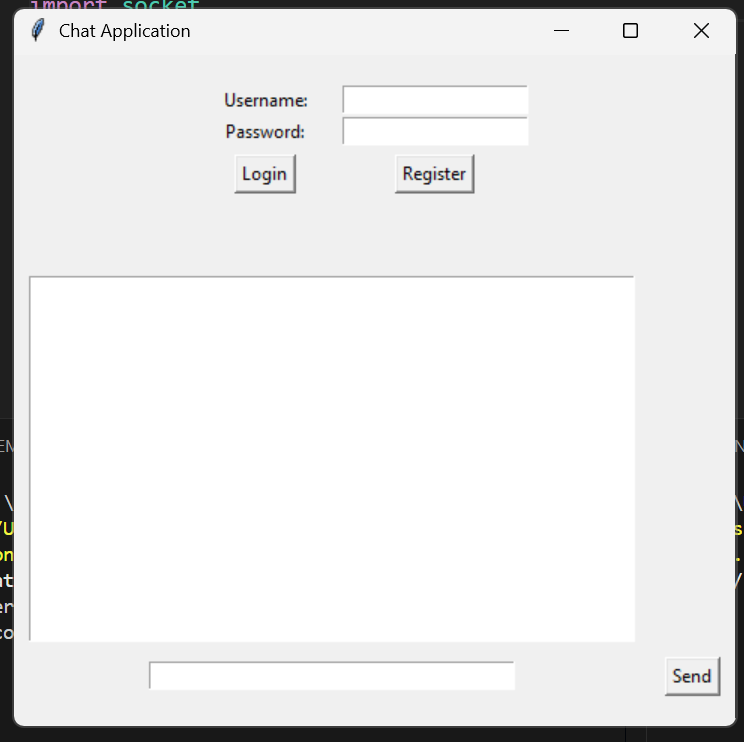
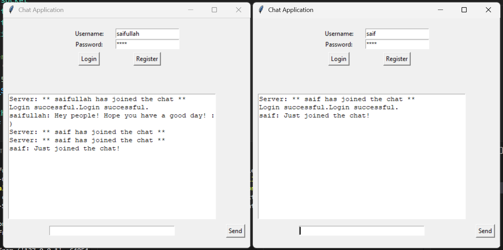

# Client-Server Group Chat Application

This is a simple client-server group chat application built using Python. The client application provides a graphical user interface (GUI) for users to register, login, and participate in a group chat. The server application handles user registration, login, and message broadcasting.

## Features

- **User Registration and Login**: Users can register with a username and password, and then login to the chat application.
- **Group Chat**: Messages sent by users are broadcasted to all connected clients.
- **Private Messaging**: Users can send private messages to specific users.
- **User Status Notifications**: Users are notified when someone joins or leaves the chat.

## Technologies Used

- **Python**: The main programming language used for both client and server.
- **Tkinter**: Used for creating the GUI of the client application.
- **Socket Programming**: Used for communication between the client and server.
- **Bcrypt**: Used for hashing user passwords.

## Installation and Setup

### Prerequisites

- Python 3.x installed on your machine.

### Clone the Repository

```bash
git clone https://github.com/Saifullahkhan31/Client-Server-Group-Chat.git
cd Client-Server-Group-Chat
```

## Install Required Packages

Install the required Python packages using pip:

```bash
pip install bcrypt
```

## Running the Server

Navigate to the project directory and run the server:

```bash
python server.py
```
The server will start running on 127.0.0.1:5555.

## Running the Client

In another terminal, navigate to the project directory and run the client:

```bash
python client.py
```

A GUI window will open for the chat application. You can register a new user or login with an existing user.

## Usage

1. **Register:** Enter a username and password, then click on the "Register" button.
   
2. **Login:** Enter the registered username and password, then click on the "Login" button.

3. **Send Message:** Type your message in the message input field and click on the "Send" button. To send a private message, start the message with @username.

## Screenshots

### Login/Register Screen


### Chat Screen


## Contributing

Contributions are welcome! Please fork the repository and submit a pull request.

## License

This project is licensed under the MIT License. See the LICENSE file for details.

